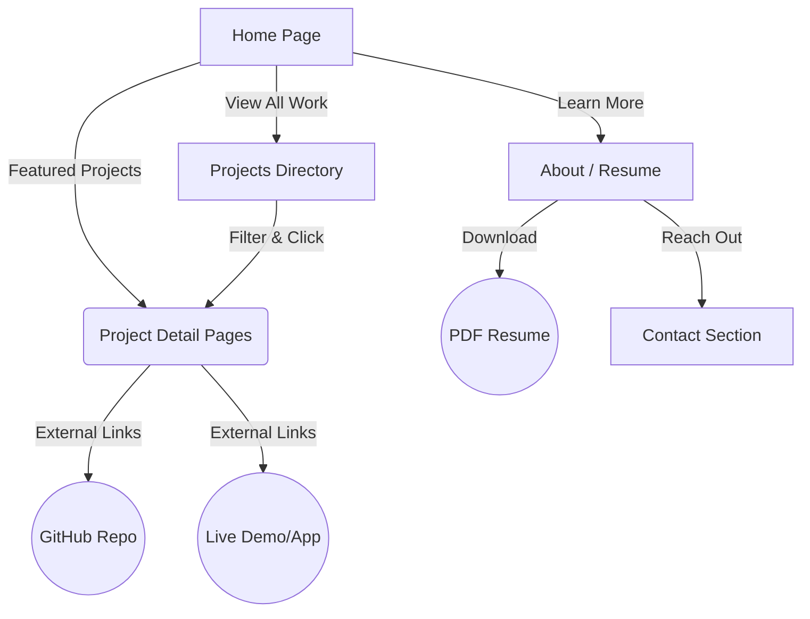

# ML Engineer & Data Analyst Portfolio Website Plan

## 1. Tech Stack Recommendation

To create a **premium, dynamic, and lightning-fast** portfolio that impresses recruiters, we should use a streamlined and modern stack:

*   **Build Tool**: **Vite** (Provides an extremely fast development server and optimized production build).
*   **Core Logic & Structure**: **Vanilla JavaScript (ES6+)** and **Semantic HTML5**. (Ensures the site is lightweight and avoids the overhead of complex frameworks unless a fully-fledged web app is needed).
*   **Styling**: **Vanilla CSS (CSS Variables, Flexbox/Grid)**. (Allows for bespoke, high-end "glassmorphism" aesthetics, smooth gradients, and tailored typography without the generic feel of utility libraries).
*   **Animations**: **CSS Transitions** and lightweight JS for scroll-triggered micro-animations (e.g., Intersection Observer) to make the interface feel responsive and "alive".
*   **Hosting**: **Vercel** or **Netlify** (for seamless, continuous deployment from GitHub).

## 2. Required Pages (High-Level Overview)

A recruiter spends roughly 1-2 minutes scanning a portfolio. The architecture should be optimized for discoverability:

1.  **Home Page (`index.html`)**: The "Elevator Pitch". High-impact landing area, quick summary of your expertise, and highlights of your top 2-3 projects.
2.  **Projects Directory (`projects.html`)**: A searchable/filterable grid of your ML and data analysis work (e.g., NLP, Computer Vision, Predictive Modeling, Dashboards).
3.  **Project Detail Pages (`project-name.html`)**: Deep dives into individual case studies. This is crucial for ML roles to explain *why* and *how* you built something, not just the code.
4.  **About / Resume Page (`about.html`)**: Your background, education, core tech stack (PyTorch, TensorFlow, SQL, etc.), and a direct link to download your resume.
5.  **Contact Page / Section**: Simple way to reach out via email or connect on LinkedIn/GitHub.

---

## 3. Content Strategy & Page Relations

Here is how the content flows and connects across the site.

### Content Breakdown per Page

#### 1. Home Page
*   **Hero Section**: Catchy headline emphasizing AI/ML specialization. Abstract, tech-inspired background (e.g., subtle animated particle network or dark gradient).
*   **Skills Marquee**: A visually pleasing, continuously scrolling banner of your core tech (Python, Pandas, PyTorch, AWS, etc.).
*   **Featured Work**: Large cards for your 2 best projects, highlighting the problem solved and the metric improved (e.g., "Increased prediction accuracy by 15%").
*   **Call to Action (CTA)**: "View My Work" or "Let's Connect".

#### 2. Projects Directory
*   **Filters**: UI buttons to filter projects by category (e.g., *Data Visualization*, *Machine Learning*, *Generative AI*).
*   **Project Cards**: Each card contains a thumbnail (data viz or model architecture), title, short description, and tag chips (e.g., `Python`, `Scikit-Learn`).

#### 3. Project Detail Pages (The Core for ML Roles)
*   **Executive Summary**: What is the project? What was the business impact?
*   **The Problem**: Why did you build this?
*   **Data & Methodology**: Where did the data come from? How did you clean it? What models did you experiment with?
*   **Results & Visualizations**: Charts, graphs, or performance metrics (F1 score, RMSE, etc.).
*   **Links**: Prominent buttons to "View Source on GitHub" or "Try the Demo" (e.g., Streamlit or Gradio apps).

#### 4. About / Resume
*   **Bio**: Your journey into data and ML.
*   **Skill Matrix**: Categorized skills (Languages, ML Frameworks, MLOps, Databases).
*   **Experience/Education Timeline**: A sleek vertical timeline of your professional/academic history.
*   **Resume Download**: A prominent button.

#### 5. Global Elements (Header & Footer)
*   **Header**: Sticky navigation with links to Home, Projects, About, and a subtle "Hire Me" button.
*   **Footer**: Social links (GitHub, LinkedIn, Kaggle, Hugging Face), copyright, and email address.
